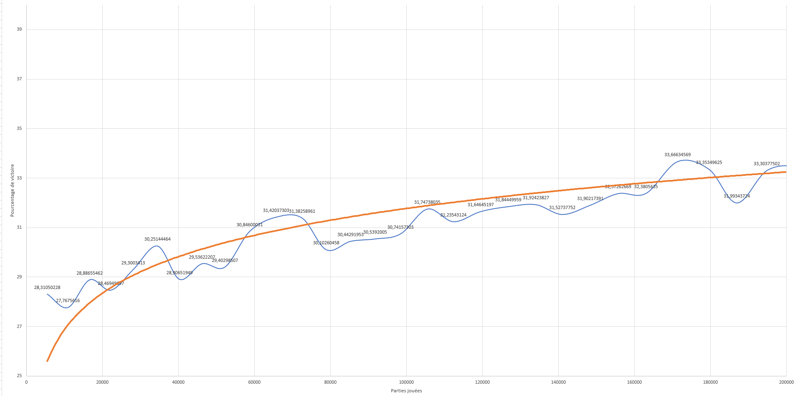
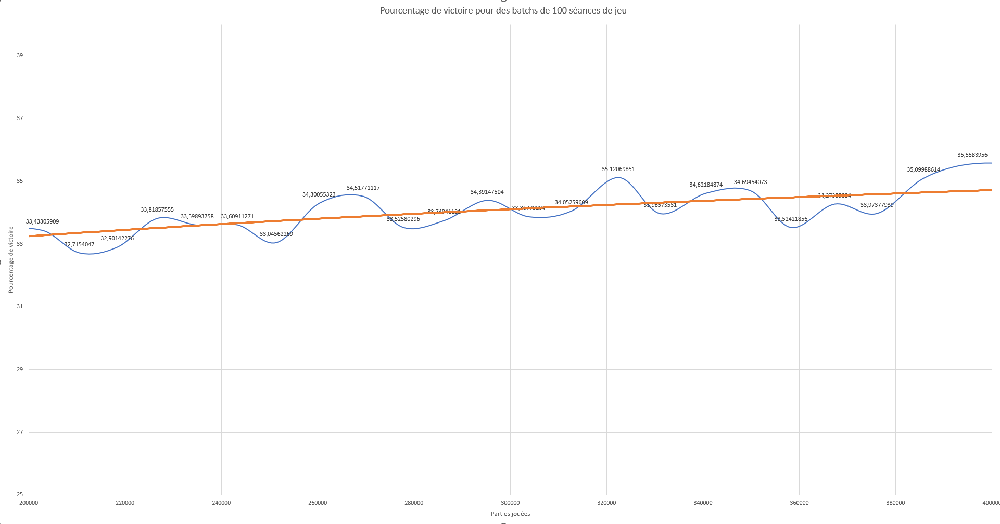
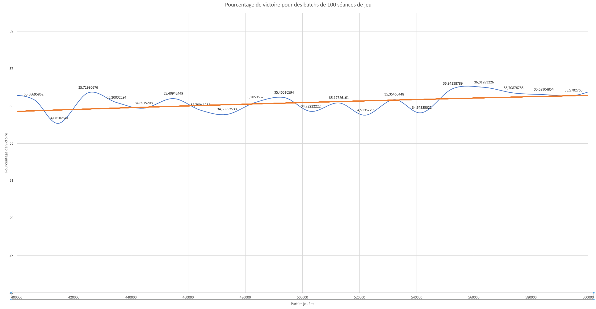
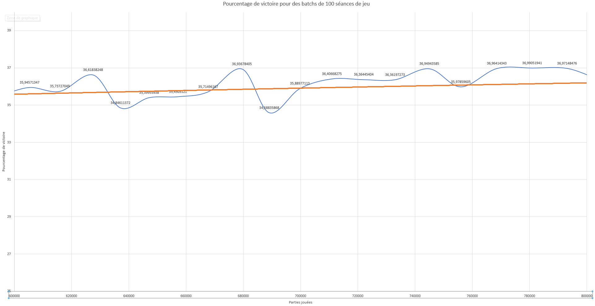
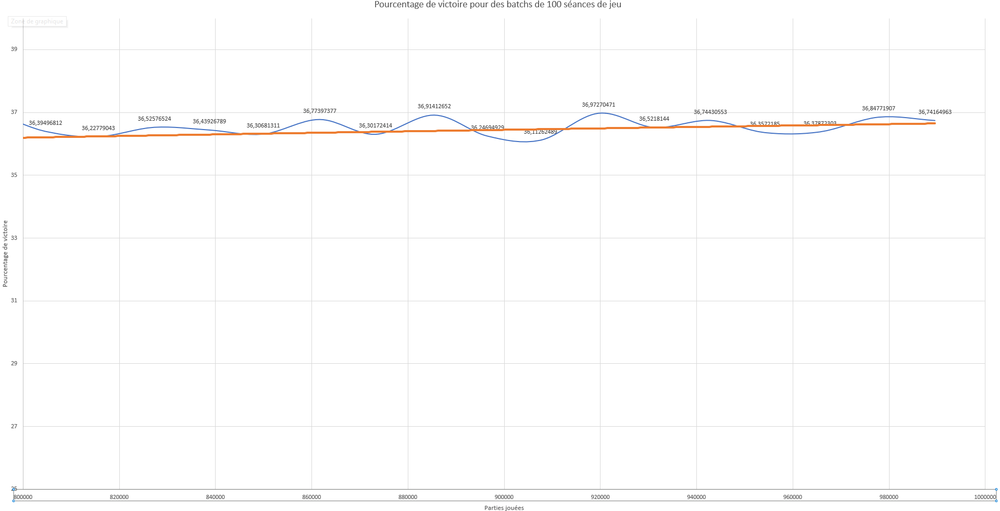

# TP BLACKJACK

---

## V1

---

La V1 de l'apprentissage enregistre et détermine le meilleur choix a faire selon ses propres expériences de jeu.

### Bases

#### Processus d'enregistrement des données:  
Les données de parties sont récoltés tout au long du processus de jeu, et stockées dans une classe "data" qui ne gère qu'une séance de jeu.  
Lors de la fin d'une séance (jusqu'a plus d'argent ou obtentiont du flag), nommées "session" dans le code, les données récoltées
(Parties jouées, parties gagnées, parties perdues) sont stockées dans la queue d'un .csv.  
Les données de victoire/défaite sont elles stockées dans un autre CSV, répartie en 6 colonnes:

| Colonne       | Details                              | Améliorations possible                                                     |
|---------------|--------------------------------------|----------------------------------------------------------------------------|
| hash_cards    | Hash unique des données d'une partie | L'ajout des paquets pourrait rendre le hash problématique                  | 
| dealer_points | Points du dealer d'une partie        | Gestion des As, je ne pense pas que ce soit nécessaire, mais c'est a faire |
| player_points | Points du joueur d'une partie        | Gestion des As, je ne pense pas que ce soit nécessaire, mais c'est a faire |
| action        | Action prise par la machine          | RAS                                                                        |
| wins          | Quantité de victoires                | Implémenter un pourcentage ?                                               |
| loses         | Quantité de défaites                 | RAS                                                                        |

#### Gestion des données :
Les données sous tout d'abord lues et converties en dictionnaire, si elle existent, dans le cas contraire, la base du CSV est crée.  
Vient ensuite la phase d'entrainement, les données sont enregistrée uniquement dans le dictionnaire, et ne sont sauvegardées automatiquement que toutes les 50 scéances.  
Lors de l'arrêt de l'entrainement, que ce soit CTRL+C ou l'arrêt du programme, une sauvegarde est également effectuée.

### Entrainement
#### Durée de l'entrainement :
L'entrainement a duré environ 3h, en plusieurs scéances d'entrainement, pour un total de 1.000.000 de parties jouées

#### Raison de l'arrêt:
Aucune raison particulière a motivé l'arrêt de l'entrainement, il était toujours possible d'entrainer plus la machine, mais le gain devenait trop faible.

#### Processus d'entrainement :
Au début de la partie, chaque action est enregistrée, la machine va chercher selon elle, quelle est le meilleur coup a prendre, pour ca elle :  
- Récupère le nombre de partie gagné pour chaque action entreprise sur un état, exemple :  
  - Dealer : 6 - Joueur : 3 - Hold - 34 Wins
  - Dealer : 6 - Joueur : 3 - Hit  - 12 Wins
- Grossis les chiffres en ajoutant 100 a chaque nombre de victoires, ce nombre peut être réduit, et permet un entrainement pseudo total de la machine.
- Calcule le pourcentage de victoire selon l'action entreprise : 
  - Total de partie = 34 + 12 + 200 = 246
  - Hit = (12 + 100) / 246 * 100 = 45.52%, hold  = (34 + 100) / 246 * 100 = 54.47%
- Prend un nombre aléatoire entre 0 et 100, avec décimale, exemple : 38.27
- Si ce nombre est inférieur à la chance de victoire en hit, elle va entreprendre l'action de hit, sinon, elle va hold. Ainsi, dans notre exemple, la machine va "hit" avec le résultat actuel.

Ce processus permet de conserver un apprentissage pendant de nombreuses parties, et d'explorer bien plus de cas.

### Résultats
#### Echantillon :
L'échantillon de résultat est d'environ 1.000.000 parties. Malgrè la quantité impréssionnante de parties, ma machine pouvait toujours apprendre.

#### Calcul : 
Le calcul est effectué sur la base du nombre total de victoires sur le nombre total de parties jouées * 100.

#### Résultat : Phase d'inconnue - 0 à 200.000 parties
Cette premiere phase fait découvrir les règles du jeu à la machine. C'est une des phase où il y a les plus gros gains, car tous les cas possible sont à apprendre.  
%Min → 27.76%  
%Max → 31.74%  
%Moyen → 30.86%

#### Résultat : Phase d'apprentissage - 200.000 à 400.000 parties
Cette seconde phase permet a la machine de consolider ses choix concernant les cas les plus communs, et commence à explorer des cas de parties un peu plus rare.  
%Min → 32.71%  
%Max → 35.55%  
%Moyen → 34.01%

#### Résultat : Phase de perfectionnement - 400.000 à 600.000 parties
Cette troisième phase assure que la machine prend la meilleure décision à chaque cas commun, elle consolide également 
ses choix pour les parties un peu plus rares. Dans cette phase, la machine a vu tous les cas possibles de partie.  
%Min → 34.08%  
%Max → 36.01%  
%Moyen → 35.19%

#### Résultat : Phase de stabilisiation - 600.000 à 800.000 parties
Cette phase donne a la machine les meilleurs choix selon les 80% des cas les plus communs de jeu.
Elle continue à apprendre lors des cas les plus rares  
%Min → 34.58% - S'explique par de la malchance  
%Max → 36.93%  
%Moyen → 36.11%

#### Résultat : Phase de micro-gains - 800.000 parties et plus
Cette phase est la derniere, et peut durer une infinitée de parties, tant l'optimisation peut être complexe.
Cette phase cherche à optimiser les 5% de cas les plus rares  
%Min → 36.11%  
%Max → 36.97%  
%Moyen → 36.51%

### Observations finales :
Je peux voir qu'avec le statut actuel de ma version 1, atteindre le 37% de victoire est largement possible, mais après un grand nombre de parties.
Il y a toujours une part de "malchance" lors des distributions, qui sera comblée dans la V2, avec le compte de cartes, et ainsi viser à obtenir le royal 43%