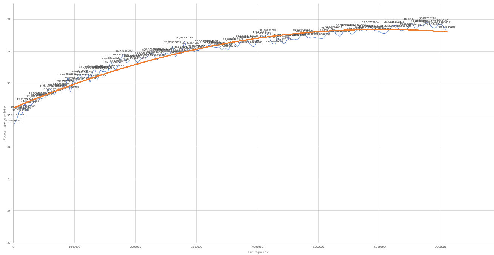

# TP BLACKJACK

---

## V2

---

La V2 de l'apprentissage enregistre et détermine le meilleur choix a faire selon ses propres expériences de jeu.

### Bases

#### Processus d'enregistrement des données:  
Les données de parties sont récoltés tout au long du processus de jeu, et stockées dans une classe "data" qui ne gère qu'une séance de jeu.  
Lors de la fin d'une séance (jusqu'a plus d'argent ou obtentiont du flag), nommées "session" dans le code, les données récoltées
(Parties jouées, parties gagnées, parties perdues) sont stockées dans la queue d'un .csv.  
Les données de victoire/défaite sont elles stockées dans un autre CSV, répartie en 6 colonnes:

| Colonne       | Details                              | Améliorations possible |
|---------------|--------------------------------------|------------------------|
| hash_cards    | Hash unique des données d'une partie | RAS                    | 
| dealer_points | Points du dealer d'une partie        | RAS                    |
| player_points | Points du joueur d'une partie        | RAS                    |
| action        | Action prise par la machine          | RAS                    |
| wins          | Quantité de victoires                | RAS                    |
| loses         | Quantité de défaites                 | RAS                    |
| deck          | Montant dans le paquet               | A voir                 |

#### Gestion des données :
Les données sous tout d'abord lues et converties en dictionnaire, si elle existent, dans le cas contraire, la base du CSV est crée.  
Vient ensuite la phase d'entrainement, les données sont enregistrée uniquement dans le dictionnaire, et ne sont sauvegardées automatiquement que toutes les 50 scéances.  
Lors de l'arrêt de l'entrainement, que ce soit CTRL+C ou l'arrêt du programme, une sauvegarde est également effectuée.

### Améliorations
#### Pistes d'amélioration
Les améliorations possible se concentrait sur deux vecteurs d'attaque : Le montant de la mise, ou le paquet. La mise n'ayant 
d'effet que sur les séances, il n'est pas utile d'y toucher.  
Le paquet en revanche est un élément très important de chaque partie, et plusieurs facons existent pour aller l'exploiter.

#### Exploitation
Le paquet possède 52 cartes différentes, si on prend compte des couleurs.  
13 cartes pour chaque type  
10 valeurs distinctes  
Mélangé lorsqu'il reste moins de 18 cartes avant un deal

Ainsi, on peut limiter les données a ceci, 4 cartes de chaque valeurs, ajouté a cela 16 cartes valant 10 (10, J, Q, K).

Ma premiere piste de réflexion était d'enregistrer l'état du paquet complet sous le format "xAx10x9x8...". Un probleme majeur se posait pour cette solution 
, le nombre de données, estimée à environ:
- 400 types de mains possible (dealer et joueur)
- 5 quantités pour chaque poids de cartes, hormis les 10 (4, 3, 2, 1, 0)
- 9 cartes valant autre chose que 10 (A, 9, 8, 7, 6, 5, 4, 3, 2)
- 16 quantités pour les cartes de poids 10 (10, J, Q, K)
- soit 5^9 * 16 * 400, soit approximativement 12,5 milliards d'états. Si on ne tient pas compte du brassage a <18 cartes

Il faudrait donc plusieurs semaines d'entrainement (et beaucoup de RAM) pour voir un début de résultat.

J'ai du donc choisir une nouvelle direction, j'ai choisis de partir en direction du calcul du poids du paquet (valeurs des cartes dans le paquet):
- 380 maximum a 0 théorique minimum
- soit 152000, toujours en ne tenant pas compte du brassage
- soit une reduction d'environ 82000%

### Entrainement
#### Durée de l'entrainement :
L'entrainement a duré environ 2 nuits, en plusieurs scéances d'entrainement, pour un total de 7.000.000 de parties jouées

#### Raison de l'arrêt:
Principalement le manque de temps et la consommation en ressource de mon ordinateur.

#### Processus d'entrainement :
Au début de la partie, chaque action est enregistrée, la machine va chercher selon elle, quelle est le meilleur coup a prendre, pour ca elle :  
- Récupère le nombre de partie gagné pour chaque action entreprise sur un état, exemple :  
  - Dealer : 6 - Joueur : 3 - Hold - 34 Wins - Paquet 282
  - Dealer : 6 - Joueur : 3 - Hit  - 12 Wins - Paquet 282
- Grossis les chiffres en ajoutant 100 a chaque nombre de victoires, ce nombre peut être réduit, et permet un entrainement pseudo total de la machine.
- Calcule le pourcentage de victoire selon l'action entreprise : 
  - Total de partie = 34 + 12 + 200 = 246
  - Hit = (12 + 100) / 246 * 100 = 45.52%, hold  = (34 + 100) / 246 * 100 = 54.47%
- Prend un nombre aléatoire entre 0 et 100, avec décimale, exemple : 38.27
- Si ce nombre est inférieur à la chance de victoire en hit, elle va entreprendre l'action de hit, sinon, elle va hold. Ainsi, dans notre exemple, la machine va "hit" avec le résultat actuel.

Ce processus permet de conserver un apprentissage pendant de nombreuses parties, et d'explorer bien plus de cas.

### Résultats
#### Echantillon :
L'échantillon de résultat est d'environ 1.000.000 parties. Malgrè la quantité impréssionnante de parties, ma machine pouvait toujours apprendre.

#### Calcul : 
Le calcul est effectué sur la base du nombre total de victoires sur le nombre total de parties jouées * 100.

#### Résultat
L'entrainement n'étant pas complet, je n'ai pas pu voir toutes les phases de l'apprentissage.  
Cependant, nous pouvons voir une nette progression positive.

### Observations finales :
Je n'ai malheureusement pas pu entrainer suffisament ma machine, ainsi, le résultat n'est que approximatif. Je peux néanmoins voir que la machine a encore beaucoup a apprendre !