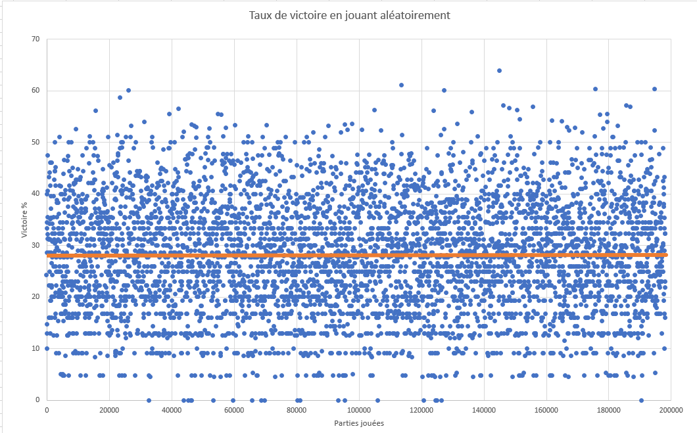

# TP BLACKJACK

---

## V0

---

La v0 de l'apprentissage machine n'utilise aucune logique d'intelligence quelqu'elle soit.  

### Bases

#### Processus d'enregistrement des données:  
Les données sont récoltés tout au long du processus de jeu, et stockées dans une classe "data" qui ne gère qu'une séance de jeu.  
Lors de la fin d'une séance (jusqu'a plus d'argent ou obtentiont du flag), nommées "session" dans le code, les données récoltées
(Parties jouées, parties gagnées, parties perdues) sont stockées dans la queue d'un .csv.  

#### Gestion des données :
Etant donnée que la v0 joue aléatoirement, les données ne sont pas lues.

### Entrainement
#### Durée de l'entrainement :
La machine a effectué un entrainement d'environ 1h, qui a généré un total d'environ 200.000 parties.

#### Raison de l'arrêt:
N'ayant aucune amélioration possible, la durée de l'entrainement était juste basé sur le souhait d'avoir beaucoup de données afin d'obtenir un pourcentage plus précis de victoire

#### Résultat de l'entrainement :
Aucun

### Résultats
#### Echantillon :
L'échantillon de résultat est d'environ 200.000 parties. Sur une quantité aussi importante de donnée, le pourcentage de victoire calculé peut être considéré comme 'fiable'.

#### Calcul : 
Le calcul est effectué sur la base du nombre total de victoire sur le nombre total de parties jouées * 100.

#### Résultat :
Comme présenté ci-dessous sur le graphique, le taux de victoire ne change pas, et selon le calcul, il est d'environ 22.25%.

